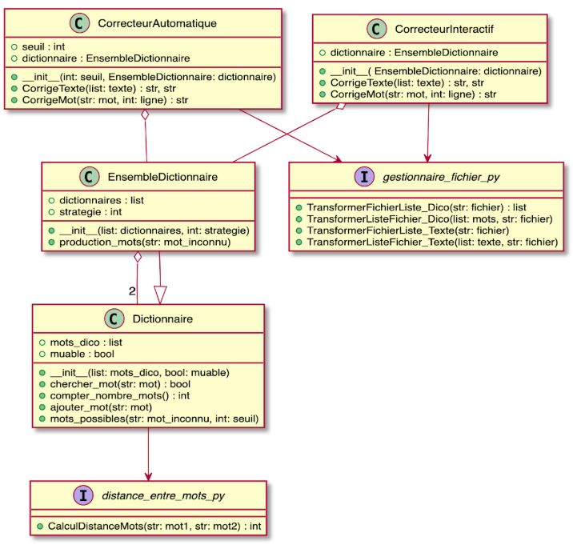
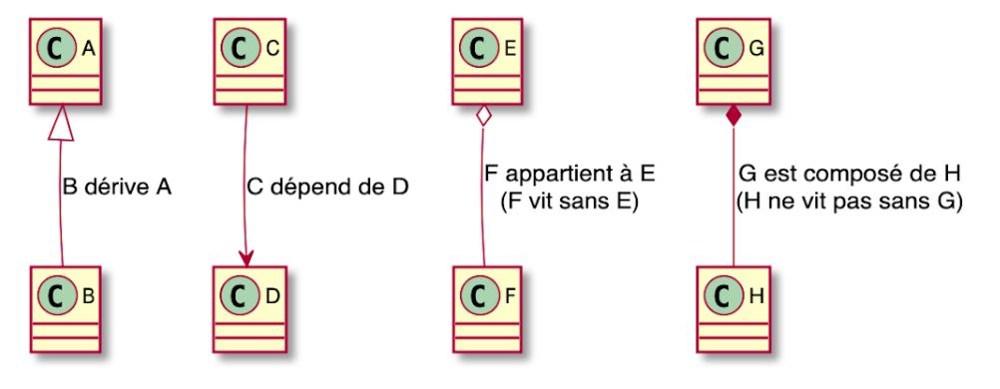

# Correcteur orthographique

[TOC]

## 1. Code

[Lien Github vers notre code hébergé en ligne](https://github.com/sebgranie/projet_info_correcteur)

### 1.1. Dependences

* **Python3**

Nous avons utilisé Python3 pour réaliser ce projet. Veuillez vérifier que vous ayez cette version installée avant d'executer le code. Pour verifier que Python3 est bien installé sur votre systèm, exécutez:

```
python3 --version
```

Vous devriez avoir un résultat qui commence par 3. Exemple:

```
Python3 3.7.7
```

* **numpy**

Nous avons choisi d'utiliser la librairie `numpy` afin de faciliter la manipulation de matrices dans la fonction de calcul de la distance entre deux mots `CalculDistanceMots()`.

Installation:

```
pip3 install numpy
```


### 1.2. Diagramme de classe

Voici le diagramme de classe representant l'architecture de notre code. Les '_I_' en violet representent des fichiers comportants seulement des fonctions.



Légende:



### 1.3. Execution

Executer les commandes suivantes dans le terminal au niveau du dossier `projet_info_correcteur` où se trouvent tous les fichiers requis par le programme:
Nous accèderons aux fichiers sources et ressources grâce à des chemins relatifs comme montré ci-dessous.
Nous utiliserons le texte `exemple1.txt` comme exemple de texte à corriger.


#### 1.4.1 Correcteur Interactif:

La commande suivante permet de lister les arguments obligatoires et optionnels de ce correcteur:

```sh
python3 icorrecteur.py --help
```

Voici un exemple sur system **Unix** (Linux et macOS):

```sh
python3 icorrecteur.py exemple1.txt \
                       exemple1_corrige.txt \
                       exemple1_correction.txt \
                       frgut.dic \
                       dictionnaire_perso.dic \
                       1
```

Voici le même exemple sur **Windows**:

```sh
python3 icorrecteur.py exemple1.txt \
                       exemple1_corrige.txt \
                       exemple1_correction.txt \
                       frgut.dic \
                       dictionnaire_perso.dic \
                       1
```
En précisant la commande `-v` suite à ceux listé ci-dessus, elle permet en tant qu'utilisateur du programme de recevoir plus d'information de la part du programme en affichant plus d'informations dans le terminal.

#### 1.4.2 Correcteur Automatique:

La commande suivante permet de lister les arguments obligatoires et optionnels de ce correcteur:

```sh
python3 acorrecteur.py --help
```

* **Unix** (Linux et macOS):

```sh
python3 acorrecteur.py exemple1.txt \
                       exemple1_corrige.txt \
                       exemple1_correction.txt \
                       frgut.dic \
                       dictionnaire_perso.dic \
                       4 \
                       1
```

* **Windows**:

```sh
python3 acorrecteur.py exemple1.txt \
                       exemple1_corrige.txt \
                       exemple1_correction.txt \
                       frgut.dic \
                       dictionnaire_perso.dic \
                       4 \
                       1
```

Le fonctionnement de la commande `-v`reste valable également pour le correcteur automatique.

### 1.3. Tests

Le module `pytest` doit être installé pour exécuter les tests. Veuillez l'installer de cette manière:
```
pip3 install pytest
```

Pour exécuter tous les tests du projet, écrire:

```bash
pytest
```

Voici les resultats attendus:

```
================================== test session starts ===================================
platform darwin -- Python 3.7.7, pytest-5.4.1, py-1.8.1, pluggy-0.13.1
rootdir: <chemin>/projet_info_correcteur
collected 8 items
dictionnaire_test.py ....                                                           [ 50%]
distance_entre_mots_test.py .                                                       [ 62%]
gestionnaire_fichier_test.py ...                                                    [100%]

=================================== 8 passed in 0.45s ====================================
```

### Section équivalente au LISEZ.MOI.txt

#### Les fichiers Python
`icorrecteur.py`: Le correcteur interactif.
`acorrecteur.py`: Le correcteur automatique.
`distance_entre_mots.py`: Calculateur de distance entre deux mots.
`dictionnaire.py`: Les classes dictionnaire et EnsembleDictionnaire qui englobent des méthodes qui permettent d'effectuer des opérations sur les dictionnaires.
`gestionnaire_fichier.y`: Catalogue de fonctions qui permettent de transformer des fichiers en liste et inversement.

#### Les textes et dictionnaires
`frgut.dic`: Le dictionnaire français du projet GUTenberg.
`dico1.dic`: Dictionnaire réduit utilisé pour faire tourner le programme plus rapidement.
`dico_perso.txt`: Dictionnaire personnel de l'utilisateur.
`exemple1.txt`: Exemple de texte à corriger.
`exemple2.txt`: Exemple de texte à utiliser pour trouver des voies d'optimisation de notre programme.

#### Les fichiers tests Python
`distance_entre_mots_test.py`: Fichier test du calculateur de distance entre deux mots.
`dictionnaire_test.py`: Fichier test des classes dictionnaire et EnsembleDictionnaire
`gestionnaire_fichier_test.py`: Fichier test du gestionnaire de fichier
