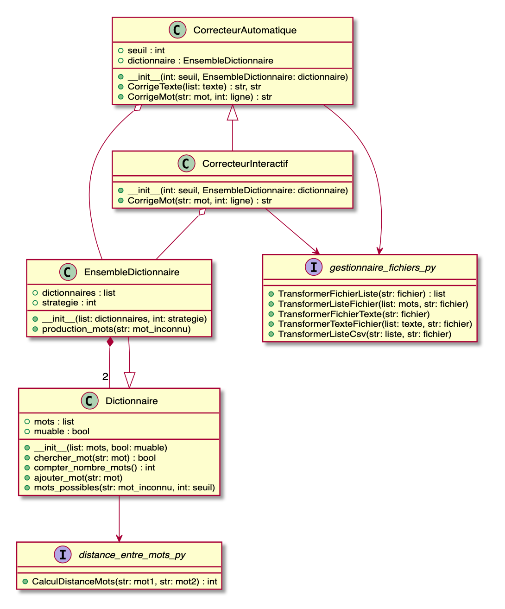

# Correcteur orthographique

[TOC]

## 1. Code

### 1.1. Dependences

* **Python3**

Nous avons utilisé Python3 pour réaliser ce projet. Veuillez vérifier que vous ayez cette version installée avant d'executer le code. Pour verifier que Python3 est bien installé sur votre systèm, exécutez:

```
python3 --version
```

Vous devriez avoir un résultat qui commence par 3. Exemple:

```
Python3 3.7.7
```

* **numpy**

Nous avons choisi d'utiliser la librairie `numpy` afin de faciliter la manipulation de matrices dans la fonction de calcul de la distance entre deux mots `CalculDistanceMots()`.

Installation:

```
pip3 install numpy
```


### 1.2. Diagramme de classe

Voici le diagramme de classe representant l'architecture de notre code. Les '_I_' en violet representent des fichiers comportants seulement des fonctions.



### 1.3. Execution

Executer les commandes suivantes dans le terminal au niveau du dossier `projet_info_correcteur` où se trouvent tous les fichiers requis par le programme:
Nous accèderons aux fichiers sources et ressources grâce à des chemins relatifs comme montré ci-dessous.
Nous utiliserons le texte `ressources/exemple1.txt` comme exemple de texte à corriger.

#### 1.4.1 Correcteur Interactif:

La commande suivante permet de lister les arguments obligatoires et optionnels de ce correcteur:

```sh
python3 sources/icorrecteur.py --help
```

Voici un exemple sur system **Unix** (Linux et macOS):

```sh
python3 sources/icorrecteur.py ressources/exemple1.txt \
                               ressources/exemple1_corrige.txt \
                               ressources/exemple1_correction.txt \
                               4 \
                               ressources/frgut.dic \
                               ressources/dictionnaire_perso.dic
```

Voici le même exemple sur **Windows**:

```sh
python3 sources\icorrecteur.py ressources\exemple1.txt \
                               ressources\exemple1_corrige.txt \
                               ressources\exemple1_correction.txt \
                               4 \
                               ressources\frgut.dic \
                               ressources\dictionnaire_perso.dic
```

#### 1.4.2 Correcteur Automatique:

La commande suivante permet de lister les arguments obligatoires et optionnels de ce correcteur:

```sh
python3 sources/acorrecteur.py --help
```

* **Unix** (Linux et macOS):

```sh
python3 sources/acorrecteur.py ressources/exemple1.txt \
                               ressources/exemple1_corrige.txt \
                               ressources/exemple1_correction.txt \
                               4 \
                               ressources/frgut.dic \
                               ressources/dictionnaire_perso.dic
```

* **Windows**:

```sh
python3 sources\acorrecteur.py ressources\exemple1.txt \
                               ressources\exemple1_corrige.txt \
                               ressources\exemple1_correction.txt \
                               4 \
                               ressources\frgut.dic \
                               ressources\dictionnaire_perso.dic
```


### 1.3. Tests

Le module `pytest` doit être installé pour exécuter les tests. Veuillez l'installer de cette manière:
```
pip3 install pytest
```

Pour exécuter tous les tests du projet, écrire:

```bash
$ pytest tests/
```

Voici les resultats attendus:

```
================================== test session starts ===================================
platform darwin -- Python 3.7.7, pytest-5.4.1, py-1.8.1, pluggy-0.13.1
rootdir: <chemin>/projet_info_correcteur
collected 8 items
tests/dictionnaire_test.py ....                                                    [ 50%]
tests/distance_entre_mots_test.py .                                                [ 62%]
tests/gestionnaire_fichier_test.py ...                                             [100%]

=================================== 8 passed in 0.43s ====================================
```
