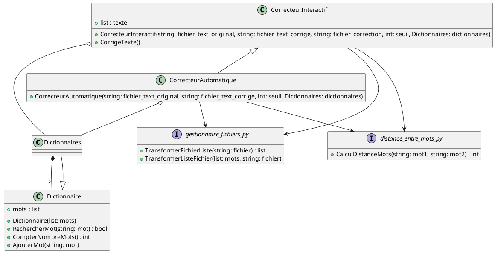

# Diagramme de classe




Liste de mots en python

```py


dic1 = Dictionnaire(["arbre", "Animal", "vélo"])
dic2 = Dictionnaire(["voiture"])

dic2.AjouterMot("stylo")

```

Liste de mots dans un fichier dictionnaire

`perso.dic`:
```txt
arbre
Animal
vélo
```

@startuml{title.png}

class Animal {
}

class Elephant {
}

Animal ^-- Elephant

class Voiture {
}

class Roue {
}

Voiture *-- "4" Roue

@enduml
```