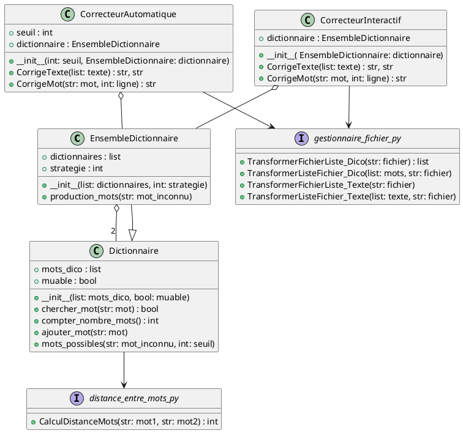
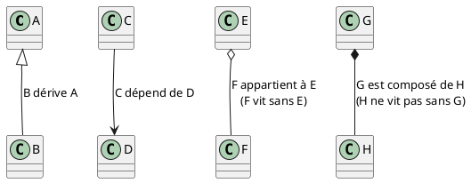

# Diagramme de classe

```puml
@startuml

class EnsembleDictionnaire {
  + __init__(list: dictionnaires, int: strategie)
  + production_mots(str: mot_inconnu)
  + dictionnaires : list
  + strategie : int
}

EnsembleDictionnaire o-- "2" Dictionnaire
Dictionnaire ^-- EnsembleDictionnaire

class Dictionnaire {
  + __init__(list: mots_dico, bool: muable)
  + chercher_mot(str: mot) : bool
  + compter_nombre_mots() : int
  + ajouter_mot(str: mot)
  + mots_possibles(str: mot_inconnu, int: seuil)
  + mots_dico : list
  + muable : bool
}

interface gestionnaire_fichier_py {
  + TransformerFichierListe_Dico(str: fichier) : list
  + TransformerListeFichier_Dico(list: mots, str: fichier)
  + TransformerFichierListe_Texte(str: fichier)
  + TransformerListeFichier_Texte(list: texte, str: fichier)
}

interface distance_entre_mots_py {
  + CalculDistanceMots(str: mot1, str: mot2) : int
}

class CorrecteurAutomatique {
  + __init__(int: seuil, EnsembleDictionnaire: dictionnaire)
  + CorrigeTexte(list: texte) : str, str
  + CorrigeMot(str: mot, int: ligne) : str
  + seuil : int
  + dictionnaire : EnsembleDictionnaire
}

class CorrecteurInteractif {
  + __init__( EnsembleDictionnaire: dictionnaire)
  + CorrigeTexte(list: texte) : str, str
  + CorrigeMot(str: mot, int: ligne) : str
  + dictionnaire : EnsembleDictionnaire
}

CorrecteurInteractif --> gestionnaire_fichier_py
CorrecteurInteractif o-- EnsembleDictionnaire
CorrecteurAutomatique --> gestionnaire_fichier_py
Dictionnaire --> distance_entre_mots_py
CorrecteurAutomatique o-- EnsembleDictionnaire


@enduml
```

```puml
@startuml
A ^-- B : B dérive A
C --> D : C dépend de D
E o-- F : F appartient à E\n(F vit sans E)
G *-- H : G est composé de H\n(H ne vit pas sans G)
@enduml
```
